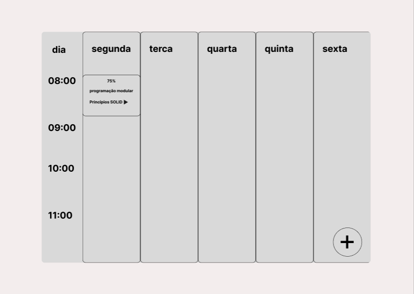
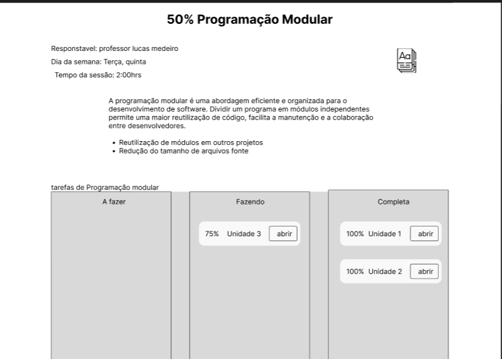

# Projeto de Interface

## Diagrama de Fluxo

O diagrama apresenta o estudo do fluxo de interação do usuário com o sistema interativo e  muitas vezes sem a necessidade do desenho do design das telas da interface. Isso permite que o design das interações seja bem planejado e gere impacto na qualidade no design do wireframe interativo que será desenvolvido logo em seguida.

As referências abaixo irão auxiliá-lo na geração do artefato “Diagramas de Fluxo”.

## Wireframes

esta tela do wireframe referesse ao: RF-11 O sistema deve permitir que o usuário visualize as tarefas a serem realizadas na semana sem formato de grade, bem como visualizar somente as que serão realizadas no dia em que está acessando o sistema.

esta tela do wireframe referesse ao: RF-15 O sistema deve permitir que o usuário visualize as tarefas princiais e subtarefas

São protótipos usados em design de interface para sugerir a estrutura de um site web e seu relacionamentos entre suas páginas. Um wireframe web é uma ilustração semelhante do layout de elementos fundamentais na interface.

> **Links Úteis**:

> - [Figma](https://www.figma.com/)